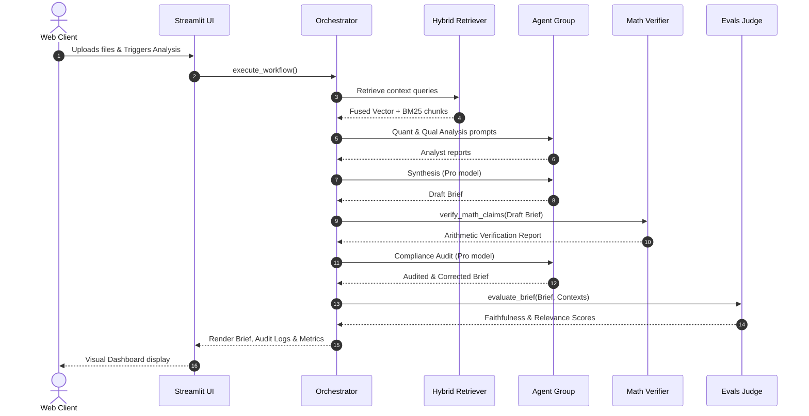

# System Architecture & Design

This document details the high-level architecture, component responsibilities, data flow lifecycles, and failure handling mechanisms of the **EarningsIQ** system.

---

## 🏗️ High-Level System Architecture

EarningsIQ is structured as a modular, pipeline-driven multi-agent system. It isolates the concerns of ingestion, document retrieval, agentic reasoning, deterministic math verification, and LLMOps evaluation.

```mermaid
graph TD
    UI[Streamlit Web UI] <--> Orch[Orchestrator]
    
    subgraph Ingestion Layer
        PDF[PDF Parser - PyMuPDF]
        PPTX[Slide Parser - Vision/DPI]
        Audio[Audio Parser - Gemini File API]
    end
    
    subgraph Storage & RAG Layer
        Chroma[(ChromaDB Vector Store)]
        BM25[BM25 Index]
        Retriever[Hybrid Retriever]
    end
    
    subgraph Agentic Orchestration Layer
        AgentBase[Base Agent - Rate Limit Backoff]
        Quant[Quantitative Analyst]
        Qual[Qualitative Analyst]
        Synth[Synthesis Writer]
        Audit[Compliance Auditor]
    end
    
    subgraph Verification & Evals
        Math[Deterministic Math Verifier]
        LLMOps[Gemini Evals Judge]
    end

    Orch --> Ingestion Layer
    Ingestion Layer --> Storage & RAG Layer
    Orch --> Retriever
    Retriever --> Agentic Orchestration Layer
    Agentic Orchestration Layer --> Math
    Math --> Audit
    Audit --> LLMOps
    LLMOps --> Orch
```

---

## 🔀 Component Responsibilities

| Component | Layer | Purpose | Technology |
| :--- | :--- | :--- | :--- |
| **Ingestion Engine** | Ingestion | Parses SEC reports, slides, and call logs into clean markdown segments. | `PyMuPDF` (Fitz), `PIL` |
| **ChromaDB Indexer** | Storage | Computes embeddings in parallel batches and writes transactions under mutex lock. | `chromadb`, `ThreadPoolExecutor` |
| **Hybrid Retriever** | Retrieval | Scores candidates using fused BM25 Okapi keyword overlap (50%) and Vector similarity (50%). | `rank-bm25`, `google-genai` |
| **Agent Workspace** | Reasoning | Executes dialogue prompts with exponential backoff retries on rate limits. | `google-genai` (Flash/Pro) |
| **Math Recalculator** | Verification | Extracts mathematical calculations and validates arithmetic correctness in Python. | `re`, Python interpreter |
| **LLMOps Evaluator** | Evals | Performs LLM-as-a-judge faithfulness, relevance, and grounding assessments. | `google-genai` (Flash) |

---

## 🔄 Data Flow Lifecycles

### 1. Ingestion & Indexing Flow
When quarters materials are uploaded:
1. **Document Parsing**: PDFs are parsed concurrently. Slide presentations compress pixel images as JPEGs to reduce transfer payloads.
2. **Text Chunking**: Segment blocks are created using paragraph sliding windows to prevent boundary truncation.
3. **Database Write**: Duplicate chunks of matching source files are purged. Embeddings are generated in parallel batches and written to local database files under a SQLite mutex thread lock (`DB_LOCK`).

### 2. Request & Execution Lifecycle
The following sequence diagram outlines the workflow from user upload to evaluation results:



---

## 🛡️ Failure Handling & Error Recovery

To guarantee enterprise robustness in production cloud servers, the architecture incorporates defensive mechanisms:
* **API Rate Limit Resilience**: The `BaseAgent` class wraps all generative calls in a retry loop using exponential backoff. If it receives an HTTP `429 Too Many Requests` error, it backs off and retries.
* **Streamlit hot-reload recovery**: Wraps the orchestrator execution inside a dynamic `try...except TypeError` block, preventing cache conflicts when hot-reloading code segments.
* **BM25 Empty Corpus Fallback**: If the ChromaDB database is empty or BM25 corpus initialization fails, the scoring system falls back to 100% vector similarity scoring, preventing execution failure.
